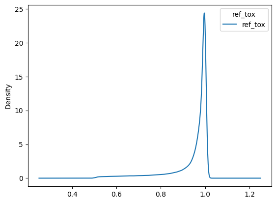
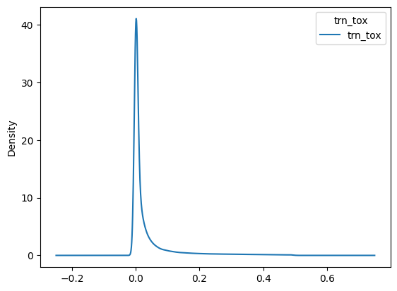
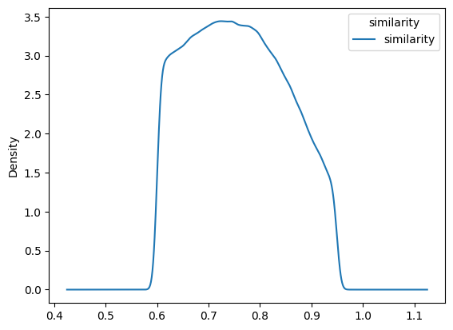
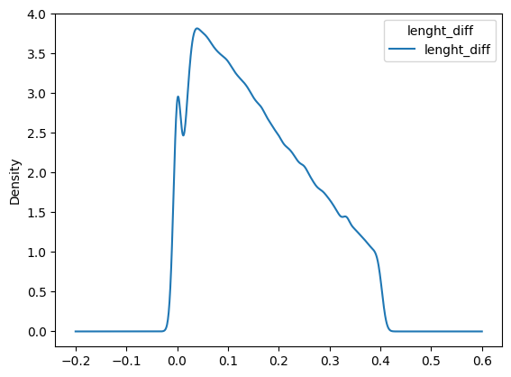
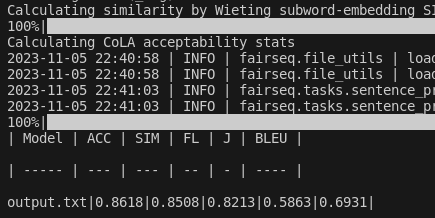
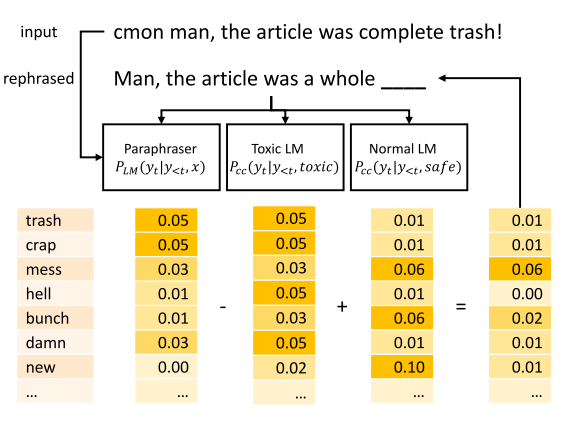
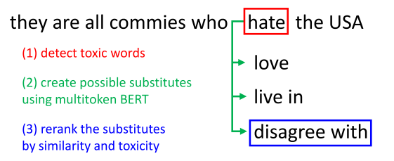
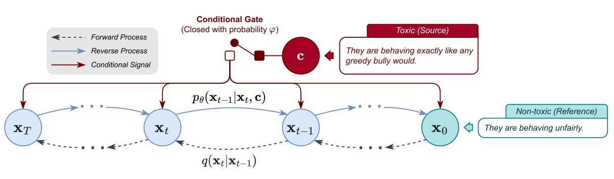
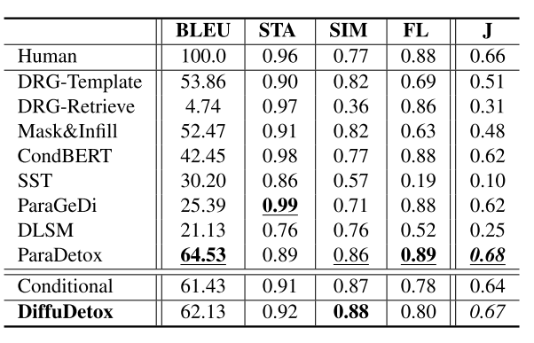
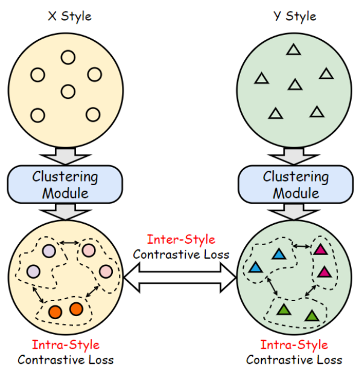

# Final Solution Report

## Introduction

Text detoxification is a subset of style transfer. 

I chose to implement the solution of text detoxification suggested in the paradetox paper. That implementation had SOTA results by 2022.

I will select data from the given paramnt dataset and merge it with the paradetox dataset.

Further, I will fine-tune BART-base for conditional generation.

Finally, I will present the metrics.

## Data analysis

The data is reference to translation style transfer. If the reference is it not considered toxic, then its translation will be toxic. 

I do not want this in my final data, so I swap the columns to get the following distribution of reference and translation toxicity

- 
- 

I do not want my toxic to neutral sequences to have a big difference in their length and similarity

So, in the I choose under the following condition

- ref_toxicity >= 0.9
- similarity >= mean of similarity
- lenght_diff <= mean of length_diff

Finally, I concatenate the selected data with paradetox dataset.

## Model Specification

BART-base for conditional generation 

## Training Process

- dataset with 20,000 toxic-neutral pairs 
- 20 epochs
- Adam optimizer
- learning rate -3e5

## Evaluation

For the evaluation I use the method used in Text Detoxification using Large Pre-trained Neural Models paper

## Results

| model | ACC | SIM | FL | J |
| --- | --- | --- | --- | --- | 
| my | 0.8618 | **0.8508** | **0.8213** | **0.5863** |
| ParaGeDi | **0.95** | 0.66 | 0.80 | 0.50 ± 0.0032 | 
| CondBERT | 0.94 | 0.69 | 0.77 | 0.50 ± 0.0037 |
<!-- | paradetox |  | 0.89 | 0.86 | --- | 64.53 |  -->

# Solution Building Report 

The following are exerts from referenced material. Sorry for just copy-pasting them. I did not have time to distill the information

## Delete toxic words

## Replace toxic words with non-toxic analogues

## ParaGeDi (Paraphrasing Generative Discriminator)

ParaGeDi, is capable of fully regenerating the input. It is based on two ideas: 
- external control of an output of a generation model by a
class-conditioned LM (Krause et al., 2020) and 
- formulation of style transfer task as paraphrasing (Kr-
ishna et al., 2020).

The original GeDi model consists of two compo-
nents: a generation model (GPT-2) and a discrim-
ination model, which is also a GPT-2 trained on
sentences with additional sentence-level style label-
ing — during training the style label is prepended
to a sentence. This makes the discriminating model
learn the word distributions conditioned on a partic-
ular label. At each generation step, the distribution
of the next token predicted by the main model PLM
is modified using an additional class-conditional
language model PD and the Bayes rule:

The name GeDi stands for Generative Discrimi-
nator, because a language model, which is gener-
ative by its nature, is used as a discriminator for
guiding the generation process. GeDi was success-
fully applied to guiding a GPT-2 language model
towards generating texts of particular topics and
making the generated text less toxic.

In order to enable GeDi to preserve the meaning
of the input text, we replace the regular language model in it with a model capable of paraphrasing

The last step is an approximation because the
class probability should be conditioned on both x
and y. However, this approximation, although not
being fully justified, allows us to decouple the para-
phraser model (which requires a parallel corpus for
training) from the style model (which requires only
texts with style labels, not necessarily parallel).
The paraphraser and the style model can be trained
independently. Moreover, we can plug in any para-
phraser as long as it shares the vocabulary with
the class-conditional LM. The third (optional) com-
ponent of this model is a reranker — an external
model which reweighs the hypotheses generated
by the style LM-guided paraphraser with respect
to the style. Our reranker is a pre-trained toxicity
classifier which chooses the least toxic hypothe-
sis generated by the ParaGeDi model. Figure 1
illustrates the workflow of our model.

ParaGeDi is trained as follows.

## CondBERT (Conditional BERT)

CondBERT, inspired by Wu et al. (2019a),
follows the pointwise editing setup. It uses BERT
to replace toxic spans found in the sentence with
their non-toxic alternatives. The semantic simi-
larity is maintained by showing the original text
to BERT and reranking its hypotheses based on
the similarity between the original words and their
substitutes. Interestingly, BERT does not need
any class-conditional pre-training to successfully
change the text style from toxic to normal.

BERT (Devlin et al., 2019) has been trained on
the task of filling in gaps (“masked LM”), we can
use it to insert non-toxic words instead of the toxic
ones. This approach has been suggested by Wu
et al. (2019a) as a method of data augmentation.
The authors identify words belonging to the source
style, replace them with the [MASK] token, and
the BERT model then inserts new words of the
desired style in the designated places. To push
BERT towards the needed style, the authors fine-
tune BERT on a style-labelled dataset by replacing
segmentation embeddings of original BERT with
trainable style embeddings.
We perform some changes to this model to adapt
it for the detoxification task. While in the origi-
nal conditional BERT model the words are masked
randomly, we select the words associated with toxicity
This can be done in different ways, e.g. by
training a word-level toxicity classifier or manu-
ally creating a vocabulary of rude and toxic words.
We use a method which does not require any ad-
ditional data or human effort. 
we train a logistic bag-of-words toxicity classifier. This is a logis-
tic regression model which classifies sentences as
toxic or neutral and uses their words as features. The words with
the highest weights are usually toxic.

For each word in a sentence, we compute
the toxicity score and then define toxic words
as the words with the score above a threshold
t = max(tmin, max(s1, s2, ..., sn)/2), where
s1, s2, ..., sn are scores of all words in a sentence
and tmin = 0.2 is a minimum toxicity score. This
adaptive threshold allows balancing the percentage
of toxic words in a sentence so that we avoid cases
when too many or no words are marked as toxic.

To preserve the meaning of the replaced word,
we employ the content preservation heuristics sug-
gested by Arefyev et al. (2020): (i) Preserve the
original tokens instead of masking them before the
replacement; (ii) Rerank the replacement words
suggested by BERT by the similarity of their em-
bedding with the embedding of the original word

Finally, we enable BERT to replace a single
[MASK] token with multiple tokens. We generate
each next token progressively by beam search and
score each multitoken sequence by the harmonic
mean of the probabilities of its tokens.

## BART ParaDetox

ParaDetox is a corpus of parallel data for detoxification models. The data consists of 10,000 English toxic sentences and up to 3 neutral paraphrases.

BART model is fine-tuned on this corpus to achieve state-of-the-art performance. The model is trained "for 10,000 epochs with learning rate of 3e-5 and the number of gradient accumulation steps set to 1. The other parameters are set to default values".

## DiffuDetox

a mixed
conditional and unconditional diffusion model
for text detoxification 
- The conditional model
takes toxic text as the condition and reduces
its toxicity, yielding a diverse set of detoxified
sentences. 
- The unconditional model is trained
to recover the input text, which allows the introduction of additional fluent text for training and thus ensures text fluency.

The overall framework of DiffuDetox, a mixed conditional and unconditional diffusion model. For the
conditional learning phase, the condition gate is closed with probability φ, then x0 and c are sampled from the
detoxification dataset. x0 and c are set as non-toxic text and toxic text, respectively. For the unconditional learning
phase, the condition gate is open with probability 1 − φ, and x0 is sampled from the fluent text corpus

we implement our mixed conditional models with
a single diffusion model where c = ∅ for the un-
conditional case. During training, the conditional
model is selected with probability φ = 0.8, and the
unconditional model is trained using the non-toxic
sentences sampled from the ParaDetox dataset and
the additional dataset with equal probabilities. We
use the union of the BookCorpus, WikiAuto, and
MNLI as the additional dataset. In the test stage,
we select the best samples from a candidate set of
20 using the J score. The reported results are from a
model trained for 1e5 steps with a batch size of 32,
and the mixture weighting parameter w in Eq. (5)
is set to 5. We use the text detoxification methods
listed in Section 2.1 as baselines.

## Text Style Transfer with Contrastive Transfer Pattern Mining

### Adaptive clustering module

### Contrastive learning module

Intra-style contrastive learning

Inter-style contrastive learning
